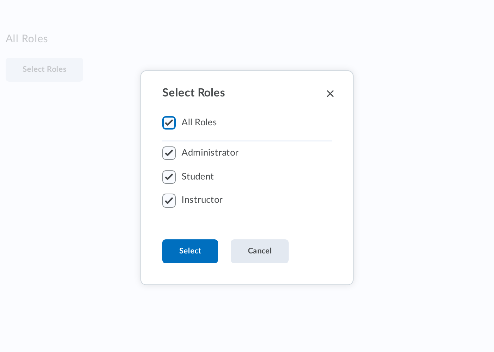

# d2l-labs-role-selector

[](https://www.npmjs.org/package/@brightspace-ui-labs/role-selector)
[](https://github.com/semantic-release/semantic-release)

> Note: this is a ["labs" component](https://github.com/BrightspaceUI/guide/wiki/Component-Tiers). While functional, these tasks are prerequisites to promotion to BrightspaceUI "official" status:
>
> - [ ] [Design organization buy-in](https://github.com/BrightspaceUI/guide/wiki/Before-you-build#working-with-design)
> - [ ] [design.d2l entry](http://design.d2l/)
> - [x] [Architectural sign-off](https://github.com/BrightspaceUI/guide/wiki/Before-you-build#web-component-architecture)
> - [x] [Continuous integration](https://github.com/BrightspaceUI/guide/wiki/Testing#testing-continuously-with-travis-ci)
> - [x] [Cross-browser testing](https://github.com/BrightspaceUI/guide/wiki/Testing#cross-browser-testing-with-sauce-labs)
> - [ ] [Unit tests](https://github.com/BrightspaceUI/guide/wiki/Testing#testing-with-polymer-test) (if applicable)
> - [ ] [Accessibility tests](https://github.com/BrightspaceUI/guide/wiki/Testing#automated-accessibility-testing-with-axe)
> - [x] [Visual diff tests](https://github.com/BrightspaceUI/visual-diff)
> - [ ] [Localization](https://github.com/BrightspaceUI/guide/wiki/Localization) with Serge (if applicable)
> - [x] Demo page
> - [x] README documentation

Select roles from a dialog with role items



## Installation

To install from NPM:

```shell
npm install @brightspace-ui-labs/role-selector
```

## Usage

Include the webcomponents.js polyfill loader (for browsers who don't natively support web components), then include necessary components:

```html
<head>
	<script src="/node_modules/@webcomponents/webcomponentsjs/webcomponents-loader.js"></script>
	<script type="module">
		import '/node_modules/@brightspace-ui-labs/role-selector/role-selector.js';
		import '/node_modules/@brightspace-ui-labs/role-selector/role-item.js';
	</script>
</head>
```
Add the component to your page

### Basic Usage

```html
<d2l-labs-role-selector>
	<d2l-labs-role-item item-id="1" display-name="Role1"></d2l-labs-role-item>
	<d2l-labs-role-item item-id="2" display-name="Role2"></d2l-labs-role-item>
	<d2l-labs-role-item item-id="3" display-name="Role3"></d2l-labs-role-item>
	...
</d2l-labs-role-selector>
```

### Events

- `d2l-labs-role-selected`: fired on clicking Select button in the dialog.

**Accessibility:**

To make your usage of `d2l-labs-role-selector` accessible, use the following properties when applicable:

| Attribute | Description |
|--|--|
| | |

## Developing, Testing and Contributing

After cloning the repo, run `npm install` to install dependencies.

### Running the demos

To start an [es-dev-server](https://open-wc.org/developing/es-dev-server.html) that hosts the demo page and tests:

```shell
npm start
```

### Linting

```shell
# eslint and lit-analyzer
npm run lint

# eslint only
npm run lint:eslint

# lit-analyzer only
npm run lint:lit
```

### Testing

```shell
# lint, unit test and visual-diff test
npm test

# lint only
npm run lint

# unit tests only
npm run test:headless

# debug or run a subset of local unit tests
# then navigate to `http://localhost:9876/debug.html`
npm run test:headless:watch
```

### Visual Diff Testing

This repo uses the [@brightspace-ui/visual-diff utility](https://github.com/BrightspaceUI/visual-diff/) to compare current snapshots against a set of golden snapshots stored in source control.

The golden snapshots in source control must be updated by Github Actions.  If your PR's code changes result in visual differences, a PR with the new goldens will be automatically opened for you against your branch.

If you'd like to run the tests locally to help troubleshoot or develop new tests, you can use these commands:

```shell
# Install dependencies locally
npm i mocha -g
npm i @brightspace-ui/visual-diff puppeteer --no-save
# run visual-diff tests
mocha './test/**/*.visual-diff.js' -t 10000
# subset of visual-diff tests:
mocha './test/**/*.visual-diff.js' -t 10000 -g some-pattern
# update visual-diff goldens
mocha './test/**/*.visual-diff.js' -t 10000 --golden
```

## Versioning & Releasing

> TL;DR: Commits prefixed with `fix:` and `feat:` will trigger patch and minor releases when merged to `master`. Read on for more details...

The [sematic-release GitHub Action](https://github.com/BrightspaceUI/actions/tree/master/semantic-release) is called from the `release.yml` GitHub Action workflow to handle version changes and releasing.

### Version Changes

All version changes should obey [semantic versioning](https://semver.org/) rules:
1. **MAJOR** version when you make incompatible API changes,
2. **MINOR** version when you add functionality in a backwards compatible manner, and
3. **PATCH** version when you make backwards compatible bug fixes.

The next version number will be determined from the commit messages since the previous release. Our semantic-release configuration uses the [Angular convention](https://github.com/conventional-changelog/conventional-changelog/tree/master/packages/conventional-changelog-angular) when analyzing commits:
* Commits which are prefixed with `fix:` or `perf:` will trigger a `patch` release. Example: `fix: validate input before using`
* Commits which are prefixed with `feat:` will trigger a `minor` release. Example: `feat: add toggle() method`
* To trigger a MAJOR release, include `BREAKING CHANGE:` with a space or two newlines in the footer of the commit message
* Other suggested prefixes which will **NOT** trigger a release: `build:`, `ci:`, `docs:`, `style:`, `refactor:` and `test:`. Example: `docs: adding README for new component`

To revert a change, add the `revert:` prefix to the original commit message. This will cause the reverted change to be omitted from the release notes. Example: `revert: fix: validate input before using`.

### Releases

When a release is triggered, it will:
* Update the version in `package.json`
* Tag the commit
* Create a GitHub release (including release notes)
* Deploy a new package to NPM

### Releasing from Maintenance Branches

Occasionally you'll want to backport a feature or bug fix to an older release. `semantic-release` refers to these as [maintenance branches](https://semantic-release.gitbook.io/semantic-release/usage/workflow-configuration#maintenance-branches).

Maintenance branch names should be of the form: `+([0-9])?(.{+([0-9]),x}).x`.

Regular expressions are complicated, but this essentially means branch names should look like:
* `1.15.x` for patch releases on top of the `1.15` release (after version `1.16` exists)
* `2.x` for feature releases on top of the `2` release (after version `3` exists)
